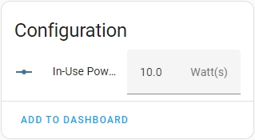

# Sonoff S31 Packages


---

This folder is a collection of packages for the BNLinkBNC-60 device.

There is 1 packages for the BNLinkBNC-60.

## bnc60.yaml
This file contains the full configuration for the device.
This includes the basic device definitions as well as control over the relay and power monitor.

This file should be included in all configurations of a BNLinkBNC-60.

Note: In this configuration, the voltage divider and current resistor vales must be provided in the substitutions. This is due to there being a large variability in manufacturing of this device, and it must be calibrated for each unit to provide accurate power monitoring.

## Sample configuration of an BNLinkBNC-60 in ESPHome

```
substitutions:
  device_name: livingroom_tv_outlet
  friendly_name: Livingroom TV Outlet
  device_description: BN Link BNC-60/U133TJ Outlet
  voltage_divider_value: "1745"
  current_resistor_value: "0.001"

packages:
  wifi: !include common/wifi.yaml
  diagnostics_package:
    url: https://github.com/SiliconAvatar/ESPHomePackages
    ref: main #Branch
    files: [Common/diagnostics.yaml]
    refresh: 1d
  bnc60_packages:
    url: https://github.com/SiliconAvatar/ESPHomePackages
    ref: main #Branch
    files: [BNLinkBNC-60/bnc60.yaml]
    refresh: 1d

# Enable Other-The-Air Updates
ota:
  password: "sd54fs6d5f46s5df4d54f6s5d4f6s5d"         # Enter OTA Password here, if it exists. If not, remove this line (Keep the "ota:" line).

# Enable Home Assistant API
api:
  encryption:                                               # If not using encryption, remove this line, and the one below. Keep the "api:" line.
    key: "AwbCDKVWN7zacrd63maE7mnG45lZsVZH/1HSPmtE0KI="     # Enter encryption Key here, if it exists. If not, remove this line.
```

## Entities Created

This packages create 4 classes of entities.

### Controls:


The only control provided is the output relay on the BNLinkBNC-60.

### Sensors:


- The Current, Power, and Voltage sensors are from the BNLinkBNC-60 power monitor. </br>

- The Powerfactor and Total Daily Energy are calculated on the device. </br>

- The Device In Use sensor is an On/Off status of the device, based on current power consumption. The threshold to trigger this value is configured in the "Configuration" area below. 


### Configuration:


- In-Use Power Threshold Configuration: This feature allows the device to present a binary sensor entity, showing if the device plugged into the outlet is in use or not </br>
To use this feature, set the "In-Use Power Threshold" to the wattage at which you want the device to be considered in use. </br>

### Diagnostics:


- Restart Button: This button will reboot the ESP8266 chip inside of the BNLinkBNC-60.

- Status: This shows the connection status of the device to HomeAssistant (Connected or Disconnected).

- Uptime Sensor: This shows the uptime (time since last reboot or reset) of the BNLinkBNC-60, in days.

- WiFi Signal: These two sensors show the signal strength of the WiFi connection in both % and dBm.