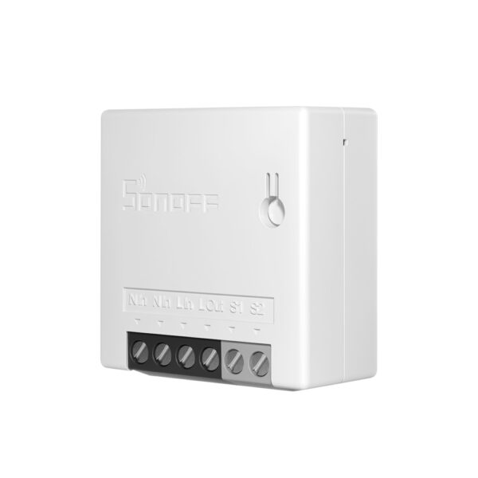

# Sonoff MiniR2 Packages


---

This folder is a collection of packages for the Sonoff MiniR2 devices.

There is 1 package for the MiniR2.

## minir2.yaml
This file contains the base configuration for the device.
This includes the basic device definitions as well as control over the relay and switch status.

This file should be included in all configurations of a MiniR2.

## Sample configuration of an MiniR2 in ESPHome

```
esphome:
  name: closet-light
  friendly_name: Closet
  comment: Sonoff MiniR2

packages:
  wifi: !include common/wifi.yaml
  diagnostics_package:
    url: https://github.com/SiliconAvatar/ESPHomePackages
    ref: main #Branch
    files: [Common/diagnostics.yaml]
    refresh: 1d
  minir2_packages:
    url: https://github.com/SiliconAvatar/ESPHomePackages
    ref: main #Branch
    files: [Sonoff_MiniR2/minir2.yaml]
    refresh: 1d

# Enable Other-The-Air Updates
ota:
  password: "sd54fs6d5f46s5df4d54f6s5d4f6s5d"         # Enter OTA Password here, if it exists. If not, remove this line (Keep the "ota:" line).

# Enable Home Assistant API
api:
  encryption:                                               # If not using encryption, remove this line, and the one below. Keep the "api:" line.
    key: "AwbCDKVWN7zacrd63maE7mnG45lZsVZH/1HSPmtE0KI="     # Enter encryption Key here, if it exists. If not, remove this line.
```
