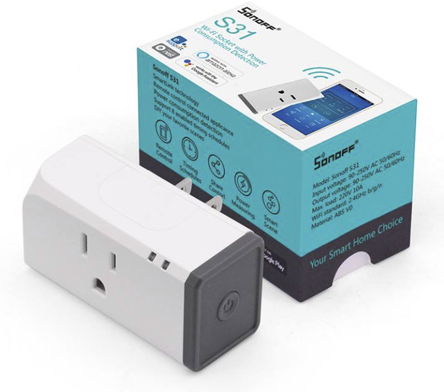

# Sonoff S31 Packages


---

This folder is a collection of packages for the Sonoff S31 and S31-Lite devices.

There are 3 packages for the S31.

## s31.yaml
This file contains the base configuration for the device.
This includes the basic device definitions as well as control over the relay, status LED, and relay.

This file should be included in all configurations of an S31 and S31-Lite.

## s31alwayson.yaml
This file contains the base configuration for the device, but removes control over the relay.
This should be used in situations where it's desirable to have an S31 installed (such as for power monitoring) but you never want the outlet to be turned off, such as for monitoring the power of a refrigerator.

This file can be used in the configuration of an S31 or S31-Lite.

## s31power.yaml
This file contains the configuration of the power monitoring sensors inside the S31.
This adds monitoring of the power, current, voltage, powerfactor, and an energy totalizer.

This file should only be included in configurations of an S31, and is not supported on the S31-Lite.

## Sample configuration of an S31 in ESPHome

```
substitutions:
  device_name: coffee-outlet
  friendly_name: Coffee Outlet
  device_description: Sonoff S31 Outlet


packages:
  wifi: !include common/wifi.yaml
  diagnostics_package:
    url: https://github.com/SiliconAvatar/ESPHomePackages
    ref: main #Branch
    files: [Common/diagnostics.yaml]
    refresh: 1d
  s33_packages:
    url: https://github.com/SiliconAvatar/ESPHomePackages
    ref: main #Branch
    files: [Sonoff_S31/s31.yaml, Sonoff_S31/s31power.yaml]
    refresh: 1d

# Enable Other-The-Air Updates
ota:
  password: "sd54fs6d5f46s5df4d54f6s5d4f6s5d"         # Enter OTA Password here, if it exists. If not, remove this line (Keep the "ota:" line).

# Enable Home Assistant API
api:
  encryption:                                               # If not using encryption, remove this line, and the one below. Keep the "api:" line.
    key: "AwbCDKVWN7zacrd63maE7mnG45lZsVZH/1HSPmtE0KI="     # Enter encryption Key here, if it exists. If not, remove this line.
```
