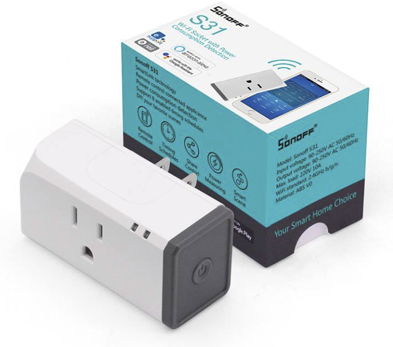
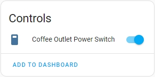
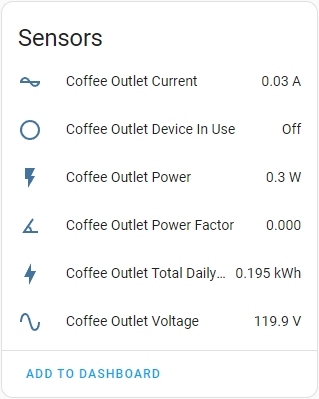
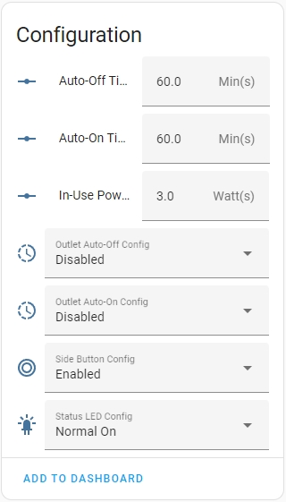
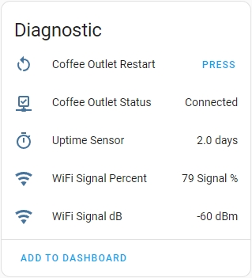

# Sonoff S31 Packages


---

This folder is a collection of packages for the Sonoff S31 and S31-Lite devices.

There are 3 packages for the S31.

## s31.yaml
This file contains the base configuration for the device.
This includes the basic device definitions as well as control over the relay, status LED, and side button.

This file should be included in all configurations of an S31 and S31-Lite.

## s31alwayson.yaml
This file contains the base configuration for the device, but removes control over the relay.
This should be used in situations where it's desirable to have an S31 installed (such as for power monitoring) but you never want the outlet to be turned off, such as for monitoring the power of a refrigerator.

This file can be used in the configuration of an S31 or S31-Lite.

## s31power.yaml
This file contains the configuration of the power monitoring sensors inside the S31.
This adds monitoring of the power, current, voltage, powerfactor, and an energy totalizer.

This file should only be included in configurations of an S31, and is not supported on the S31-Lite.

## Sample configuration of an S31 in ESPHome

```
substitutions:
  device_name: coffee-outlet
  friendly_name: Coffee Outlet
  device_description: Sonoff S31 Outlet


packages:
  wifi: !include common/wifi.yaml
  diagnostics_package:
    url: https://github.com/SiliconAvatar/ESPHomePackages
    ref: main #Branch
    files: [Common/diagnostics.yaml]
    refresh: 1d
  s33_packages:
    url: https://github.com/SiliconAvatar/ESPHomePackages
    ref: main #Branch
    files: [Sonoff_S31/s31.yaml, Sonoff_S31/s31power.yaml]
    refresh: 1d

# Enable Other-The-Air Updates
ota:
  password: "sd54fs6d5f46s5df4d54f6s5d4f6s5d"         # Enter OTA Password here, if it exists. If not, remove this line (Keep the "ota:" line).

# Enable Home Assistant API
api:
  encryption:                                               # If not using encryption, remove this line, and the one below. Keep the "api:" line.
    key: "AwbCDKVWN7zacrd63maE7mnG45lZsVZH/1HSPmtE0KI="     # Enter encryption Key here, if it exists. If not, remove this line.
```

## Entities Created

These packages (if using the s31power package) create 4 classes of entities.

### Controls:


The only control provided is the output relay on the S31.

### Sensors:


- The Current, Power, and Voltage sensors are from the S31 power monitor. </br>

- The Powerfactor and Total Daily Energy are calculated on the device. </br>

- The Device In Use sensor is an On/Off status of the device, based on current power consumption. The threshold to trigger this value is configured in the "Configuration" area below. 


### Configuration:


- Auto-Off Functionality: This feature allows the device to automatically turn off some time after being turned on. </br>
To use this feature, first set the "Outlet Auto-Off Config" to Enabled. </br>
Once this feature is enabled, set the "Auto-Off Timer" to the desired time delay between turning on the device, and it turning itself off.

- Auto-On Functionality: This feature allows the device to automatically turn on some time after being turned off. </br>
To use this feature, first set the "Outlet Auto-On Config" to Enabled. </br>
Once this feature is enabled, set the "Auto-On Timer" to the desired time delay between turning off the device, and it turning itself on.

- In-Use Power Threshold Configuration: This feature allows the device to present a binary sensor entity, showing if the device plugged into the outlet is in use or not </br>
To use this feature, set the "In-Use Power Threshold" to the wattage at which you want the device to be considered in use. </br>

- Side Button Configuration: This feature allows you to disable the button on the side of the S31 from doing anything. </br>
To enable use of the side button, set the "Side Button Config" to Enabled. </br>
To disable use of the side button, set the "Side Button Config" to Disabled. </br>

- Status LED Configuration: This feature allows you to control the normal state of the blue status LED on the S31. </br>
To keep the LED on when operating conditions are normal, set the "Status LED Config" to Normal On. </br>
To keep the LED off when operating conditions are normal, set the "Status LED Config" to Normal Off. </br>
Regardless of this setting, the LED will blink when an error is present.

### Diagnostics:


- Restart Button: This button will reboot the ESP8266 chip inside of the S31.

- Status: This shows the connection status of the device to HomeAssistant (Connected or Disconnected).

- Uptime Sensor: This shows the uptime (time since last reboot or reset) of the S31, in days.

- WiFi Signal: These two sensors show the signal strength of the WiFi connection in both % and dBm.